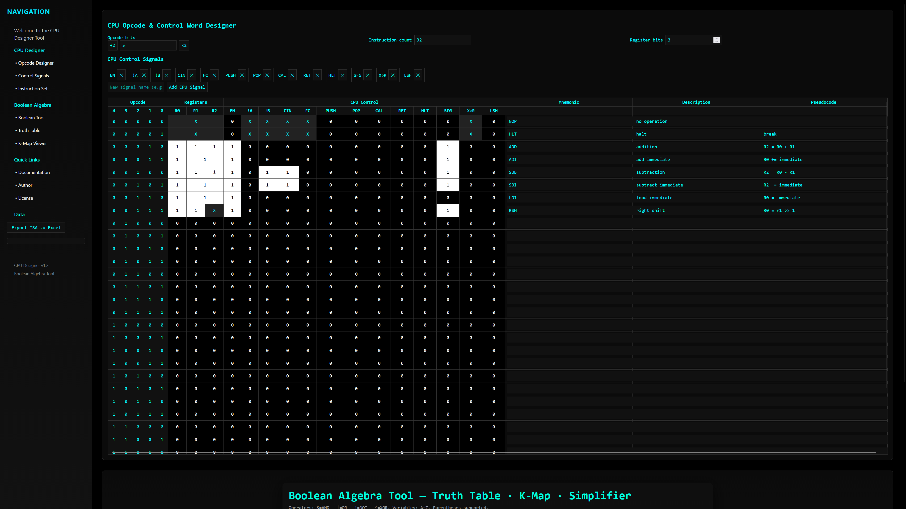

# CPU Opcode & Control Word Designer

A web-based tool for designing CPU instruction sets and their associated control signals. Allows users to define opcode widths, register bits, and CPU control signals, with real-time updates and full state persistence across browser sessions.

---

## Features

- **Dynamic Opcode Table**
  - Configure opcode bit-width.
  - Table automatically generates all instructions in binary.
  - Opcode bits are labeled with proper binary place values.

- **Instruction Count**
  - Automatically computed based on the opcode bit-width (`2^n`).

- **Register Selection**
  - Add configurable number of register select bits.

- **CPU Control Signals**
  - Add or remove CPU control signals dynamically.
  - Signals displayed in the table as interactive toggle cells (`0`, `1`, `X`).
  - Supports tri-state toggle (`0 → 1 → X → 0`).

- **Mnemonic, Description, and Pseudocode**
  - Each instruction has editable fields for mnemonic, description, and pseudocode.

- **Persistent Storage**
  - All table data, toggle states, CPU signals, opcode width, and register bits are saved in `localStorage`.
  - Data persists across page refreshes.

- **User-Friendly Interface**
  - Dark neon theme with monospace font for a classic CPU designer feel.
  - Responsive layout for CPU control signals and table.

---

## Usage

1. **Open the HTML page** in any modern browser.
2. **Set the opcode bit-width**
   - Use the `÷2` and `×2` buttons to change the opcode width.
   - Instruction count updates automatically.
3. **Set the number of register select bits** using the number input.
4. **Manage CPU control signals**
   - Add a new signal via the input field and "Add CPU Signal" button.
   - Remove a signal using the ✕ button next to each signal.
5. **Edit instructions**
   - Toggle `0`, `1`, or `X` for register and CPU control bits.
   - Fill in Mnemonic, Description, and Pseudocode for each instruction.
6. **State Persistence**
   - All changes are automatically saved and restored on refresh.

---

## Table Layout

| Section          | Description |
|-----------------|------------|
| **Opcode Bits**  | Binary representation of the instruction opcode. Number of bits is configurable. |
| **Registers**    | Configurable number of register select bits. Toggleable (`0`, `1`, `X`). |
| **CPU Control**  | Custom CPU control signals added by the user. Toggleable (`0`, `1`, `X`). |
| **Mnemonic**     | Editable text field for the instruction mnemonic. |
| **Description**  | Editable text field for instruction explanation. |
| **Pseudocode**   | Editable text field for the instruction pseudocode. |

---

## Toggle Behavior

- **0 → 1 → X → 0**  
- `0` → gray-black  
- `1` → white  
- `X` → neon blue (`#0ff`)  

---

## Customization

- **Add CPU Control Signals**
  - Use the input below "CPU Control Signals" to create new control bits.
  - Dynamically updates the table to include the new signal.
- **Remove CPU Control Signals**
  - Click the ✕ button next to any signal in the list.
  - Table automatically updates to remove the signal.

---

## Storage & Persistence

- All configuration and table data are stored in **`localStorage`** under the key:  
  `cpuDesignerState`
- Data saved:
  - Opcode bit-width
  - Register select bits
  - CPU control signals
  - Toggle states for each cell
  - Mnemonic, Description, Pseudocode content

---

## Example Use Case

1. Set opcode width to 5 bits → generates 32 instructions.
2. Add 3 register select bits → R0–R2 selectable.
3. Add CPU signals: `EN`, `CIN`, `XOR`.
4. Fill out mnemonic, description, and pseudocode for each instruction.
5. Use toggles to configure CPU control word for each instruction.
6. Refresh page → all changes are preserved.

---

## Browser Compatibility

- Works in all modern browsers supporting **`localStorage`** and standard **HTML5/CSS3/JS**.

---

## Notes

- Designed for educational and CPU design prototyping purposes.
- No backend required; entirely client-side.
- Dark theme with neon highlights optimized for readability and visual clarity.

---

## who it's aimed at

When making this I was aiming to create a tool for people designing new **CPUs**,  
I made it as customizable as possible when it comes to the **control ROM**, you can send signals to any custom  
part of the computer so it can be a Sigle Cycle, Multi Cycle, Risc, Von Neumann, Harvard, Princeton,  
literaly anything.

---

## example

---
## Copy right notice 

**Copy-right:** ©2026 David S all rights reserved   
**Creative Commons:** Copyright: © 2026 David S all rights reserved Creative-Commons: This work is licensed under a Creative    Commons Attribution-NonCommercial 4.0 International License   
**Author:** David S   
